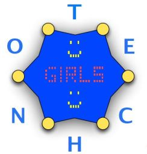
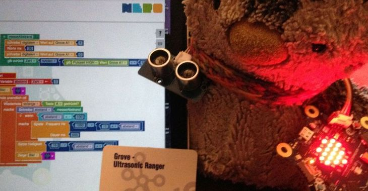

## Willkommen bei Technogirls

Technogirls ist eine Computer-AG für Mädchen am [Bertolt-Brecht-Gymnasium Dresden](https://bebe-dresden.de/)

Wir (Anfänger und Fortgeschrittene) treffen uns immer **Montags um 14:30 bis 16:00 im CK3** im Nebengebäude [(Plakat)](./TechnoGirls-Plakat.jpg).

Im letzten Schuljahr haben wir mit 12 Mädchen Projekte zu folgenden Themen gemacht.

[Vertretungsplan](https://rawgit.com/technogirls/vertretungsplan/master/vp.html?klasse=09/2) <- Klasse ändern

## Kommentare der Mädchen

Von Rana:
> TechnoGirls ist eine gute Möglichkeit für Mädchen Programmieren zu lernen und es gibt auch
keine Jungs die einen die ganze Zeit kritisieren und angeben weil sie schnell oder so sind!!!
> Alice3d war cool, weil man mit 3d Figuren gearbeitet hat. Die Minecraft-Mods haben auch 
Spaß gemacht und es war schön mit so vielen Leuten zusammen zu arbeiten.
> Fireboy and Watergirl selbst zu machen war auch cool.:)

Von Anna Lena:
> TechnoGirls hat mir im Tc/Informatik Unterricht geholfen, wenn wir mit Calliope herum gebastelt haben.
> Bei Fireboy and Watergirl gab es ein paar Probleme aber es war deswegen noch lustiger.
> Alice, Scratch, Calliope ,..... alles war ziemlich cool!
> :)


## Projekte

### Minecraft Texturen

Wir hatten viel Spass daran, Minecraft Texturen zu verändern.
Einfach mit einem Pixeleditor nach Lust und Laune anpassen.

[Hier geht es zum Download](https://github.com/technogirls/brilliant-minecraft-textures)


### Code.org

Gibt es auch in Deutsch (bis auf die Videos) auf: https://code.org/ 

Block-Programmierung mit:

* Elsa & Anna (Schön für Winkel, Schleifen usw)
* Erntespiel (Bedingungen)
* Plants vs. Zombies (Bedingungen)
* Minecraft
* Starwars (Gut wegen Interaktion + Spawn)
* Flappy Bird (Sehr zu empfehlen, da man sich die eigene App dann auch behalten kann z.b. aufs Telefon)
* Dance Party (Macht viel Spass wegen der Musik + Grooves)

### Alice 3D

https://www.alice.org/

* Einführung
* Eigene Figur mit Animationen
* Eigene Geschichte / Landschaft


* [Mehr Infos im Projekt](alice.md)

### Scratch

Wir haben Scratch Online genutzt, so dass wir die Projekte online speichern konnten.

Lokale Scratch Installation nur für [Jumping Sumo wegen speziellen Bausteinen](https://github.com/Devoxx4KidsDE/workshop-jumping-sumo-4-scratch)

https://scratch.mit.edu

* Bouncing Balls
* Uhr
* Rennspiel
* Orchester
* Geisterstunde
* Spiel: Fireboy & Watergirl (3-4 Stunden)
* Virusinfektionen

Wir haben dazu Inspirationen aus den Büchern genutzt:

* [MINT - Wissen gewinnt: Ganz easy programmieren lernen - Scratch](https://usborne.com/de/mint-wissen-gewinnt-ganz-easy-programmieren-lernen-scratch-9781789413069)
* [Spiele Programmieren supereasy](https://www.dorlingkindersley.de/buch/carol-vorderman-jon-woodcock-spiele-programmieren-supereasy-9783831040124)

Beispielprojekte:

* https://scratch.mit.edu/users/beberana/
* https://scratch.mit.edu/users/bebe-fritzi/

<!--
* https://scratch.mit.edu/users/bebe-serena/
* https://scratch.mit.edu/users/cuperundrabbat/
* https://scratch.mit.edu/users/technogirls1/
* https://scratch.mit.edu/users/bebe-heleni/
* https://scratch.mit.edu/users/bebe-victoria/
* https://scratch.mit.edu/users/bebe-antonia/
* https://scratch.mit.edu/users/bebe-cara/
* https://scratch.mit.edu/users/bebe-Flora/
* https://scratch.mit.edu/users/bebe_victoria/
-->

### Spiel: Fireboy & Watergirl

* https://scratch.mit.edu/projects/221125037/#editor
* [Mehr Infos im Projekt](https://github.com/technogirls/fireboy-watergirl)

### Calliope



* [Mehr Infos im Projekt](https://github.com/technogirls/calliope)

* Lärmampel
* Fledermaus Abstandsmesser
* Smileys senden
* Würfel
* Zahlen-Rate-Spiel
* Timer Countdown
* Disco-LED
* Neopixel
* Musik (Noten)
* Laufschrift
* Weihnachtsbaumschmuck (Laufschrift, Lichter, Lichterkette, Musik) Calliopes mit verschiedenen Programmen als Baumanhänger.
* Punkt bewegen mittels Neigungssensor

### Sonic PI

https://sonic-pi.net/ (Besonders die Beispiele weiter unten)

* Einführung
* Eigenes Lied


### Pixel-Art (Piskel-App)

* https://www.piskelapp.com/

* Einführung (Tutorials von Youtube [1](https://www.youtube.com/watch?v=lJN2C7-dyxE), [2](https://youtu.be/YClG-LR0f_U?t=33s))
* Eigenes Bild
* Eigene Animationen

* Mehr Infos hier: https://github.com/technogirls/piskel

### Jumping Sumo

* Code von [Devoxx4KidsDE](https://github.com/Devoxx4KidsDE/workshop-jumping-sumo)

* Direktes Steuern der Sumos
* Scratch mit speziellen Blöcken
* Parcour aufgebaut aus Schulheftern,-bücher, Federmappen.
* Selbständiges Fahren durch den Parcour

### Spehro-Edu

https://edu.sphero.com/

* Manuelle Steuerung von Sphero in Labyrinth
* Einfache Programme (Figur Fahren, Farbwechsel, Farbe-Raten)
* iPads von der Schule

## Java mit jshell

Inspiriert von Heinz's Kabutz freiem [Juppies (Java Guppies) Kurs](https://javaspecialists.teachable.com/p/juppies)

Wir haben http://tryjshell.org genutzt, damit braucht man keine lokale Java 10 Installation.

* Dank `var` keine Typdeklaration
* Zahlen, Addition, Subtraktion, Multiplikation
* Integer vs. Floating Point
* String, substring, indexOf, split
* Streams bes. IntStream, `toArray` für einfache Ausgabe.
* List.of(), Map.of()

```
IntStream.range(1,10).filter(i -> i > 5).map(i -> i*i).toArray();
```

## Minecraft - Mods

* Material von [Devoxx4Kids](https://github.com/devoxx4kids/materials/tree/master/workshops/minecraft)
* Setup Forge + Gradle + Eclipse
* Test-Spielen
* Wie funktioniert ein Mod (Events)

* Nur angefangen
* Spawn Diamond-Axt, Fackeln
* Creeper explodiert nicht
* Drachenei -> Ender-Drache


## Was wollen wir diesen Jahr machen?

**Montags: 14:30-16:00, CK1**

### Anfänger

1. Einführung / Demo (Calliope, Sumo, Sphero, Robo Turtles, Tinkerbots)
2. Calliope erste Schritte (Laufschrift, LED)
3. Calliope Würfel
4. Calliope Ratespiel
5. Calliope Regenbogen LED

### Fortgeschrittene

1. Besprechung Projekte - Was hat uns Spass gemacht - Mehr davon
2. Mehr Projekte über 2-4 Wochen, als Paar
3. Texte und Fotos von den Mädchen für die Projekte
4. Minecraft - Modding
4. Spiele Programmieren
5. Processing
6. Robotersteuerung Calliope
7. AR-Drone
8. Processing: https://p5js.org/

<!--

## GitHub Pages

You can use the [editor on GitHub](https://github.com/technogirls/technogirls.github.io/edit/master/README.md) to maintain and preview the content for your website in Markdown files.

Whenever you commit to this repository, GitHub Pages will run [Jekyll](https://jekyllrb.com/) to rebuild the pages in your site, from the content in your Markdown files.

### Markdown

Markdown is a lightweight and easy-to-use syntax for styling your writing. It includes conventions for

```markdown
Syntax highlighted code block

# Header 1
## Header 2
### Header 3

- Bulleted
- List

1. Numbered
2. List

**Bold** and _Italic_ and `Code` text

[Link](url) and 
```

For more details see [GitHub Flavored Markdown](https://guides.github.com/features/mastering-markdown/).

### Jekyll Themes

Your Pages site will use the layout and styles from the Jekyll theme you have selected in your [repository settings](https://github.com/technogirls/technogirls.github.io/settings). The name of this theme is saved in the Jekyll `_config.yml` configuration file.

### Support or Contact

Having trouble with Pages? Check out our [documentation](https://help.github.com/categories/github-pages-basics/) or [contact support](https://github.com/contact) and we’ll help you sort it out.

-->
